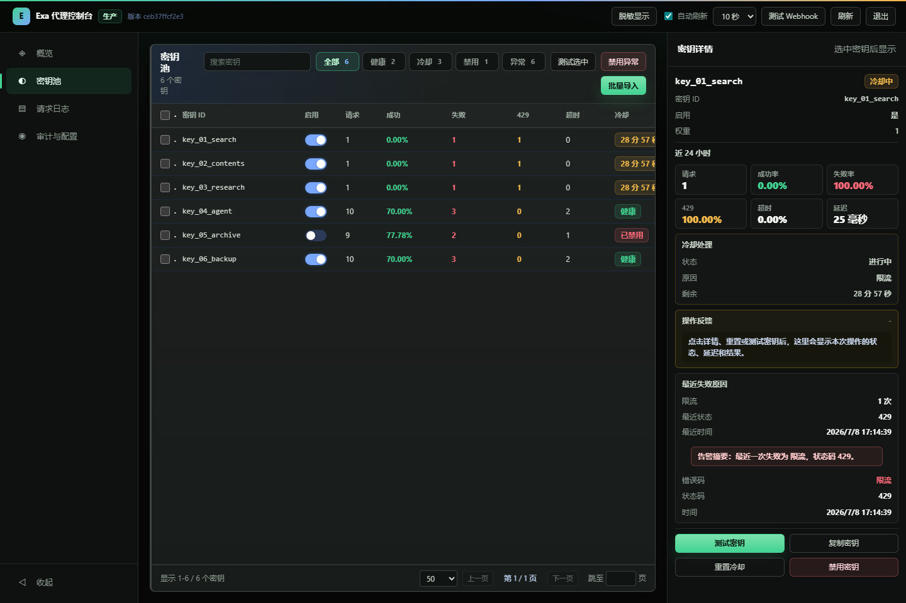

# Exa Reverse Proxy

[](https://github.com/apaidedie/exa-reverse-proxy/actions/workflows/ci.yml)
[](https://hub.docker.com/r/al1ya/exa-reverse-proxy)
[](https://hub.docker.com/r/al1ya/exa-reverse-proxy/tags)
[](https://github.com/apaidedie/exa-reverse-proxy/releases)
[](LICENSE)

把多把 Exa API Key 变成一个稳定、安全、可观测的统一入口。它适合自托管 AI 搜索、Agent 工作流和团队内部服务：下游只拿一个代理令牌，上游 Key 池由代理负责调度、故障转移、加密存储和审计。

## 控制台预览



## 为什么用它

- **Key 池化与调度**：轮询、加权、最少最近使用和自适应加权策略，避免单 Key 成为瓶颈。
- **自动故障转移**：处理 429、5xx、超时和连接错误，按安全重试规则切换上游 Key。
- **运行时密钥治理**：通过管理 API 或控制台增删改查 Key，SQLite 持久化，AES-256-GCM 加密存储。
- **资源亲和**：同一资源的后续请求优先回到创建它的 Key，降低上游状态不一致风险。
- **运维控制台**：密钥池、请求日志、链路追踪、趋势、告警、审计、批量导入和 Webhook 测试集中在一个静态 Web UI。
- **生产可观测**：Prometheus 指标、Grafana 仪表板、SSE 实时刷新、日志保留和审计导出内置可用。

## 快速试用

本地只想看控制台和交互，不需要真实 Exa Key：

```bash
npm ci
npm run demo:ui
```

打开 `http://127.0.0.1:8787`，管理员令牌是 `admin_local_token`。demo 会启动一个模拟上游并预置请求、冷却、失败和审计数据。

## Docker 部署

```bash
mkdir exa-proxy && cd exa-proxy
curl -fsSL https://raw.githubusercontent.com/apaidedie/exa-reverse-proxy/main/docker-compose.yml -o docker-compose.yml
curl -fsSL https://raw.githubusercontent.com/apaidedie/exa-reverse-proxy/main/.env.example -o .env

$EDITOR .env
docker compose up -d
```

最小 `.env`：

```dotenv
EXA_KEYS_ENCRYPTION_SECRET=<随机加密密钥，建议 openssl rand -hex 32>
EXA_PROXY_TOKENS=<客户端令牌，至少 16 字符>
EXA_ADMIN_TOKENS=<管理员令牌，至少 16 字符>
```

从源码仓库部署时可以运行 `npm run setup:env` 生成带强随机值的 `.env`，已有 `.env` 时需显式加 `-- --force` 才会覆盖。只下载 `docker-compose.yml` 和 `.env.example` 的轻量部署方式仍按上面的最小配置手动填写。

服务默认只绑定 `127.0.0.1:8787`。生产环境建议放在 Caddy/Nginx 等 HTTPS 反向代理后面，并开启 `EXA_ADMIN_REQUIRE_HTTPS=true`。

部署探针：

```bash
curl http://127.0.0.1:8787/_proxy/live     # 进程存活，不要求已有 Key
curl http://127.0.0.1:8787/_proxy/ready    # 可服务性：至少一把 Key 启用且未冷却
curl -H "Authorization: Bearer <管理员令牌>" http://127.0.0.1:8787/_proxy/health
```

添加第一把 Exa Key：

控制台批量导入适合大量 Key，脚本化接入可以直接调用 `POST /_proxy/keys`。

```bash
curl -X POST http://127.0.0.1:8787/_proxy/keys \
  -H "Authorization: Bearer <管理员令牌>" \
  -H "Content-Type: application/json" \
  -d '{"id":"exa_01","value":"<Exa API Key>","weight":1}'
```

调用代理：

```bash
curl -X POST http://127.0.0.1:8787/search \
  -H "Authorization: Bearer <客户端令牌>" \
  -H "Content-Type: application/json" \
  -d '{"query":"latest AI search news","numResults":3}'
```

## 管理接口

所有管理接口都需要 `EXA_ADMIN_TOKENS` 或管理会话认证。机器可读接口契约见 [docs/openapi.json](docs/openapi.json)。

### Key 管理

| 方法 | 路径 | 说明 |
| --- | --- | --- |
| `GET` | `/_proxy/keys` | Key 状态与调度器快照 |
| `POST` | `/_proxy/keys` | 创建 Key（`id`, `value`, `weight`） |
| `PUT` | `/_proxy/keys/:id` | 更新 Key（`value`/`weight`/`enabled`） |
| `DELETE` | `/_proxy/keys/:id` | 删除 Key（至少保留一把） |
| `POST` | `/_proxy/keys/:id/test` | 单 Key 健康检查 |
| `POST` | `/_proxy/keys/:id/disable` | 禁用 Key |
| `POST` | `/_proxy/keys/:id/enable` | 启用 Key |
| `POST` | `/_proxy/keys/:id/reset-circuit` | 清除冷却 |
| `POST` | `/_proxy/keys/:id/secret` | 查看明文（需 `EXA_ADMIN_ALLOW_RAW_KEY_DISPLAY=true`） |
| `POST` | `/_proxy/keys/batch` | 批量 enable/disable/reset/test |
| `POST` | `/_proxy/keys/import` | 批量导入 Key |

### 日志与可观测

| 方法 | 路径 | 说明 |
| --- | --- | --- |
| `GET` | `/_proxy/health` | 管理健康状态 |
| `GET` | `/_proxy/live` | 无认证存活探针 |
| `GET` | `/_proxy/ready` | 无认证可服务探针，无可用 Key 时返回 503 |
| `GET` | `/_proxy/logs` | 请求日志，支持 `limit`/`path`/`status`/`keyId` 过滤 |
| `GET` | `/_proxy/logs/trace/:requestId` | 请求链路追踪 |
| `GET` | `/_proxy/logs/export` | 导出日志 CSV |
| `POST` | `/_proxy/logs/prune` | 清理过期日志 |
| `GET` | `/_proxy/observability` | 趋势、告警、保留策略概览 |
| `GET` | `/_proxy/metrics` | Prometheus 指标 |
| `GET` | `/_proxy/events` | 控制台 SSE 实时推送流 |

### 审计与会话

| 方法 | 路径 | 说明 |
| --- | --- | --- |
| `POST` | `/_proxy/session` | 创建管理会话 |
| `DELETE` | `/_proxy/session` | 注销会话 |
| `GET` | `/_proxy/audit` | 管理操作审计记录 |
| `GET` | `/_proxy/audit/export` | 导出审计 CSV |
| `POST` | `/_proxy/alerts/webhook/test` | 测试告警 Webhook |
| `GET` | `/_proxy/config-summary` | 脱敏运行配置 |
| `GET` | `/_proxy/keys/:id/failures` | 单 Key 故障摘要 |

## 安全模型

- 下游客户端只使用 `EXA_PROXY_TOKENS`，不能直接接触上游 Exa Key。
- 转发前会剥离下游传入的 `Authorization`、`x-api-key` 等敏感头，再注入被调度的上游 Key。
- 上游 Key 默认不在 UI 或 API 响应中明文展示，复制原始 Key 必须显式开启 `EXA_ADMIN_ALLOW_RAW_KEY_DISPLAY=true` 并写入审计。
- SQLite 中的 Key 可使用 `EXA_KEYS_ENCRYPTION_SECRET` 加密存储。
- 管理会话有 TTL、失败登录锁定、可选 HTTPS 强制和严格静态资源 CSP。
- 请求日志记录内部 Key ID、请求状态、路径、延迟和错误类型，不记录明文上游 Key。

## 配置

常用配置见 `.env.example`。关键可选项：

| 变量 | 默认值 | 说明 |
| --- | --- | --- |
| `EXA_SELECTION_STRATEGY` | `weighted_round_robin` | `round_robin`、`weighted_round_robin`、`least_recently_used`、`adaptive_weighted` |
| `EXA_ALLOWED_PATHS` | `/**` | 允许代理的路径列表 |
| `EXA_MAX_ATTEMPTS` | `3` | 可安全重试请求的最大尝试数 |
| `EXA_ATTEMPT_TIMEOUT_MS` | `30000` | 单次上游请求超时 |
| `EXA_LOG_RETENTION_DAYS` | `14` | 请求日志保留天数 |
| `EXA_PROXY_RATE_LIMIT_PER_MINUTE` | `0` | 下游代理请求速率限制，0 表示关闭 |
| `EXA_ALERT_WEBHOOK_URL` | 空 | 告警 Webhook 目标 |

## 运维

```bash
npm run backup:docker
npm run restore:docker -- backups/exa-proxy-state-*.tar.gz --yes
```

长期运行可定期维护 SQLite：

```bash
sqlite3 /data/exa-proxy.sqlite "PRAGMA wal_checkpoint(TRUNCATE); VACUUM; PRAGMA integrity_check;"
```

监控接入和反向代理示例见 [docs/DEPLOYMENT.md](docs/DEPLOYMENT.md)。部署前检查见 [docs/DEPLOYMENT_CHECKLIST.md](docs/DEPLOYMENT_CHECKLIST.md)。

## 开发与验证

```bash
npm ci
npm run dev          # 本地启动真实代理
npm run demo:ui      # 控制台演示，无需真实 Key
npm run setup:env    # 生成带强随机值的 .env
npm run lint         # TypeScript 类型检查
npm test             # Vitest 单元/集成测试
npm run test:e2e     # Playwright 控制台流程
npm run verify       # secret scan + lint + test + audit + build
```

需要 Node.js 22+。Docker 镜像基于 `node:22-bookworm-slim`。

## 许可

[MIT](LICENSE)
