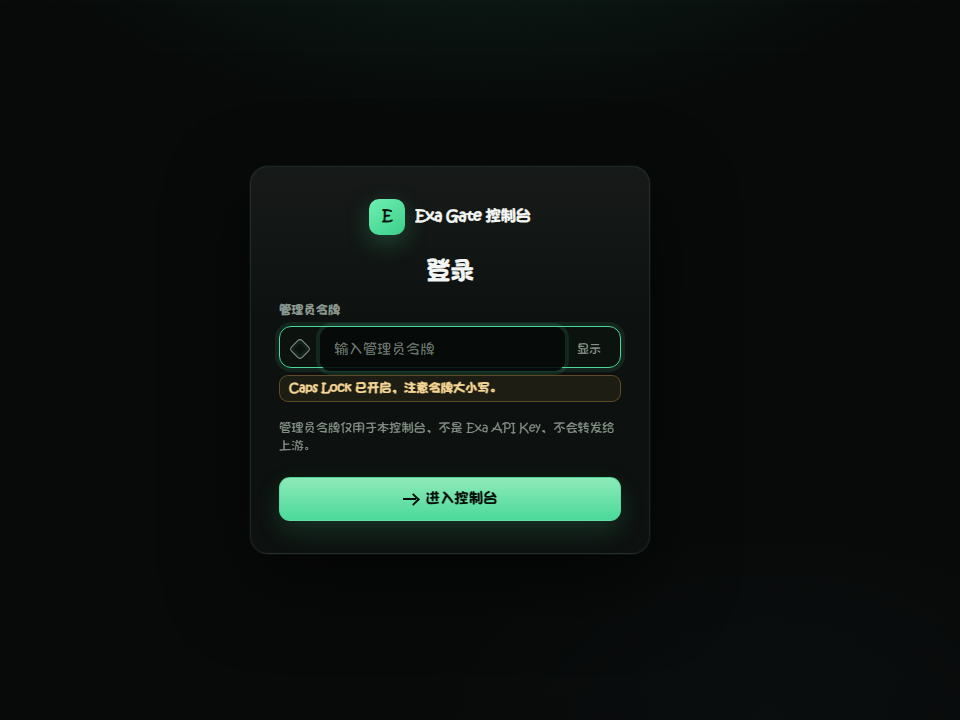
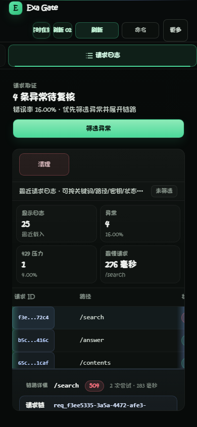

# Exa Gate

[](https://github.com/apaidedie/exa-gate/actions/workflows/ci.yml)
[](https://github.com/apaidedie/exa-gate/actions/workflows/codeql.yml)
[](https://hub.docker.com/r/al1ya/exa-gate)
[](https://hub.docker.com/r/al1ya/exa-gate/tags)
[](https://github.com/apaidedie/exa-gate/releases)
[](LICENSE)

把多把 Exa Key 变成一个稳定、可观测、可审计的团队 API 出口。

Exa Gate 是一个可自托管的 Exa API 控制平面，面向 AI 搜索产品、Agent 工作流和团队内部服务。业务侧只保留一个客户端令牌；Key 池调度、冷却、故障转移、加密存储、日志审计、告警和控制台治理都在代理层统一处理。你得到的是一个可部署、可验证、可交给团队使用的 Exa 网关，而不是散落在脚本里的密钥轮换逻辑。


桌面首屏展示真实本地 demo：运行态势英雄区、关键 KPI、用量趋势、告警中心与密钥健康会一起给出当前运行判断。截图由 `npm run capture:preview` 从本地渲染生成，不是手工拼图。

| 评估点 | 项目给你的答案 |
| --- | --- |
| 多把 Exa Key 怎么稳定共用 | 轮询、加权、最少最近使用和自适应调度，自动跳过冷却或异常 Key。 |
| 出问题时怎么定位 | 控制台内置请求日志、链路追踪、失败样本、告警摘要、Prometheus 指标和审计记录。 |
| 能不能放心交给团队用 | 客户端令牌和管理员令牌分离，上游 Key 脱敏展示，SQLite 可加密，管理操作可审计。 |
| 要多久才能判断值不值得部署 | `npm run demo:ui` 可在本地启动完整演示，不需要真实 Exa Key，也不会访问真实 Exa API。 |

[先判断是否适合](#先判断它是否适合你) · [选择上手路径](#选择你的上手路径) · [60 秒试用](#60-秒试用) · [控制台预览](#控制台预览) · [Docker 部署](#docker-部署) · [管理接口](#管理接口) · [安全模型](#安全模型)

## 先判断它是否适合你

| 适合 | 不适合 |
| --- | --- |
| 适合：团队共享多把 Exa Key，并希望下游服务只持有一个客户端令牌。 | 不适合：只需要临时调用一把 Key，不需要审计、故障转移、指标或控制台。 |
| 适合：Agent、搜索服务、内部工具需要统一出口、统一限流和可追踪日志。 | 不适合：希望使用托管 SaaS 控制台，或不准备维护自托管服务。 |
| 适合：你要在 VPS、内网或私有环境里掌握密钥、日志和备份。 | 不适合：上游 Exa Key 不能写入任何本地持久化介质。 |

## 选择你的上手路径

| 目标 | 路径 | 你会得到什么 |
| --- | --- | --- |
| 先看真实界面 | `npm ci && npm run demo:ui` | 不需要真实 Exa Key 的本地控制台、演示 Key、请求日志、链路追踪和告警样本。 |
| 本机源码运行 | `npm run setup:env` 后 `npm run dev` | 带强随机令牌的源码环境，可接入真实 Exa Key 做开发验证。 |
| VPS / 生产部署 | 下载 `docker-compose.yml`，改密钥后 `docker compose up -d` | 拉取 GHCR 镜像，端口 `8787`，数据卷 `./data`；生产建议加 HTTPS 反代。 |

## 60 秒试用

本地只想判断控制台体验，不需要真实 Exa Key：

```bash
git clone https://github.com/apaidedie/exa-gate.git
cd exa-gate
npm ci
npm run demo:ui
```

打开 `http://127.0.0.1:8787`，管理员令牌是 `admin_local_token`。

这个 demo 会自动准备一套可操作数据，不会访问真实 Exa API，也不会要求你先配置生产密钥：

- 6 把演示 Key、模拟上游和冷却状态。
- 最近请求、链路追踪、失败样本和日志导出。
- 审计记录、告警摘要、Webhook 测试和运行配置概览。

## 控制台预览

截图由 `npm run capture:preview` 从本地 demo 实时渲染生成，和 `npm run demo:ui` 看到的是同一套静态控制台。预览覆盖三个关键判断点：受控访问入口、桌面运维总览和移动端链路诊断。

**受控访问入口**



生产向登录卡只接受管理员令牌；文案标明「不是 Exa API Key」。Caps Lock 提示会在令牌输入时即时出现，不影响提交。

**桌面运维总览**

桌面截图已放在 README 首屏，方便先判断产品质感和信息密度。概览页聚焦运行态势、健康密钥/请求/错误率 KPI、用量趋势、告警中心与密钥健康，共同形成全局运维判断。

**移动端请求日志**



移动端截图保留从请求日志到链路面板的实操路径。控制台是纯静态 HTML/CSS/ES Modules，默认 CSP 不需要放宽，也不依赖外部字体或 CDN。

## 为什么值得用

| 信号 | 项目已经内置 |
| --- | --- |
| 生产入口 | Docker Compose、健康探针、只监听本机的默认端口和反向代理部署文档。 |
| 安全边界 | 客户端令牌和管理员令牌分离，上游 Key 默认脱敏，SQLite 可加密，管理操作写审计。 |
| 可观测性 | 请求日志、链路追踪、Prometheus 指标、Grafana 面板、SSE 实时刷新和 Webhook 测试。 |
| 可维护性 | CI、CodeQL、Dependabot、OpenAPI 3.1 契约、Playwright E2E 和 `npm run verify`；运行时栈含 Fastify 5、undici 8、better-sqlite3 12（Node ≥ 22）。 |
| 运维效率 | 静态 Admin Console 支持 Key 导入、批量操作、冷却重置、过滤搜索、日志/审计导出。 |

## 核心能力

| 能力 | 你得到什么 |
| --- | --- |
| Key 池化与调度 | 轮询、加权、最少最近使用和自适应加权策略，避免单 Key 成为瓶颈。 |
| 自动故障转移 | 处理 429、5xx、超时和连接错误，按安全重试规则切换上游 Key。 |
| 运行时密钥治理 | 通过管理 API 或控制台增删改查 Key，SQLite 持久化，AES-256-GCM 加密存储。 |
| 资源亲和 | 同一资源的后续请求优先回到创建它的 Key，降低上游状态不一致风险。 |
| 运维控制台 | 密钥池、请求日志、链路追踪、趋势、告警、审计、批量导入和 Webhook 测试集中在一个静态 Web UI。 |
| 生产可观测 | Prometheus 指标、Grafana 仪表板、SSE 实时刷新、日志保留和审计导出内置可用。 |

## 适用场景

- 团队需要共享多把 Exa Key，但不希望业务服务直接接触上游密钥。
- Agent、搜索服务或内部工具需要一个稳定的 Exa 出口和统一的客户端令牌。
- 自托管环境需要可审计、可备份、可监控的密钥治理，而不是临时脚本。
- 生产运行中需要快速判断 Key 健康、冷却原因、失败趋势和最近请求链路。

## Docker 部署

```bash
mkdir exa-gate && cd exa-gate
curl -fsSL https://raw.githubusercontent.com/apaidedie/exa-gate/main/docker-compose.yml -o docker-compose.yml
# 编辑 compose 里的三个密钥（EXA_KEYS_ENCRYPTION_SECRET / EXA_PROXY_TOKENS / EXA_ADMIN_TOKENS）
docker compose up -d
```

镜像：`ghcr.io/apaidedie/exa-gate:latest`。数据目录：`./data`。控制台：`http://<host>:8787`。

生产环境建议放在 Caddy/Nginx 等 HTTPS 反向代理后面，并开启 `EXA_ADMIN_REQUIRE_HTTPS=true`。

部署探针：

```bash
curl http://127.0.0.1:8787/_proxy/live     # 进程存活，不要求已有 Key
curl http://127.0.0.1:8787/_proxy/ready    # 可服务性：至少一把 Key 启用且未冷却
curl -H "Authorization: Bearer <管理员令牌>" http://127.0.0.1:8787/_proxy/health
```

添加第一把 Exa Key：

控制台批量导入适合大量 Key，脚本化接入可以直接调用 `POST /_proxy/keys`。

```bash
curl -X POST http://127.0.0.1:8787/_proxy/keys \
  -H "Authorization: Bearer <管理员令牌>" \
  -H "Content-Type: application/json" \
  -d '{"id":"exa_01","value":"<Exa API Key>","weight":1}'
```

调用代理：

```bash
curl -X POST http://127.0.0.1:8787/search \
  -H "Authorization: Bearer <客户端令牌>" \
  -H "Content-Type: application/json" \
  -d '{"query":"latest AI search news","numResults":3}'
```

## 管理接口

所有管理接口都需要 `EXA_ADMIN_TOKENS` 或管理会话认证。机器可读接口契约见 [docs/openapi.json](docs/openapi.json)，服务启动后也可直接访问 `http://127.0.0.1:8787/_proxy/openapi.json`。

### Key 管理

| 方法 | 路径 | 说明 |
| --- | --- | --- |
| `GET` | `/_proxy/keys` | Key 状态与调度器快照 |
| `POST` | `/_proxy/keys` | 创建 Key（`id`, `value`, `weight`） |
| `PUT` | `/_proxy/keys/:id` | 更新 Key（`value`/`weight`/`enabled`） |
| `DELETE` | `/_proxy/keys/:id` | 删除 Key（至少保留一把） |
| `POST` | `/_proxy/keys/:id/test` | 单 Key 健康检查 |
| `POST` | `/_proxy/keys/:id/disable` | 禁用 Key |
| `POST` | `/_proxy/keys/:id/enable` | 启用 Key |
| `POST` | `/_proxy/keys/:id/reset-circuit` | 清除冷却 |
| `POST` | `/_proxy/keys/:id/secret` | 查看明文（需 `EXA_ADMIN_ALLOW_RAW_KEY_DISPLAY=true`） |
| `POST` | `/_proxy/keys/batch` | 批量 enable/disable/reset/test |
| `POST` | `/_proxy/keys/import` | 批量导入 Key |

### 日志与可观测

| 方法 | 路径 | 说明 |
| --- | --- | --- |
| `GET` | `/_proxy/health` | 管理健康状态 |
| `GET` | `/_proxy/live` | 无认证存活探针 |
| `GET` | `/_proxy/ready` | 无认证可服务探针，无可用 Key 时返回 503 |
| `GET` | `/_proxy/logs` | 请求日志，支持 `limit`/`path`/`status`/`keyId` 过滤 |
| `GET` | `/_proxy/logs/trace/:requestId` | 请求链路追踪 |
| `GET` | `/_proxy/logs/export` | 导出日志 CSV |
| `POST` | `/_proxy/logs/prune` | 清理过期日志 |
| `GET` | `/_proxy/observability` | 趋势、告警、保留策略概览 |
| `GET` | `/_proxy/metrics` | Prometheus 指标 |
| `GET` | `/_proxy/events` | 控制台 SSE 实时推送流 |

### 审计与会话

| 方法 | 路径 | 说明 |
| --- | --- | --- |
| `POST` | `/_proxy/session` | 创建管理会话 |
| `DELETE` | `/_proxy/session` | 注销会话 |
| `GET` | `/_proxy/audit` | 管理操作审计记录 |
| `GET` | `/_proxy/audit/export` | 导出审计 CSV |
| `POST` | `/_proxy/alerts/webhook/test` | 测试告警 Webhook |
| `GET` | `/_proxy/config-summary` | 脱敏运行配置 |
| `GET` | `/_proxy/keys/:id/failures` | 单 Key 故障摘要 |

## 安全模型

- 下游客户端只使用 `EXA_PROXY_TOKENS`，不能直接接触上游 Exa Key。
- 转发前会剥离下游传入的 `Authorization`、`x-api-key` 等敏感头，再注入被调度的上游 Key。
- 上游 Key 默认不在 UI 或 API 响应中明文展示，复制原始 Key 必须显式开启 `EXA_ADMIN_ALLOW_RAW_KEY_DISPLAY=true` 并写入审计。
- SQLite 中的 Key 可使用 `EXA_KEYS_ENCRYPTION_SECRET` 加密存储。
- 管理会话有 TTL、失败登录锁定、可选 HTTPS 强制和严格静态资源 CSP。
- 请求日志记录内部 Key ID、请求状态、路径、延迟和错误类型，不记录明文上游 Key。

## 配置

常用配置见 `.env.example`。关键可选项：

| 变量 | 默认值 | 说明 |
| --- | --- | --- |
| `EXA_SELECTION_STRATEGY` | `weighted_round_robin` | `round_robin`、`weighted_round_robin`、`least_recently_used`、`adaptive_weighted` |
| `EXA_ALLOWED_PATHS` | `/**` | 允许代理的路径列表 |
| `EXA_MAX_ATTEMPTS` | `3` | 可安全重试请求的最大尝试数 |
| `EXA_ATTEMPT_TIMEOUT_MS` | `30000` | 单次上游请求超时 |
| `EXA_LOG_RETENTION_DAYS` | `14` | 请求日志保留天数 |
| `EXA_PROXY_RATE_LIMIT_PER_MINUTE` | `0` | 下游代理请求速率限制，0 表示关闭 |
| `EXA_ALERT_WEBHOOK_URL` | 空 | 告警 Webhook 目标 |

## 运维

```bash
npm run backup:docker
npm run restore:docker -- backups/exa-proxy-state-*.tar.gz --yes
```

长期运行可定期维护 SQLite：

```bash
sqlite3 /data/exa-proxy.sqlite "PRAGMA wal_checkpoint(TRUNCATE); VACUUM; PRAGMA integrity_check;"
```

监控接入和反向代理示例见 [docs/DEPLOYMENT.md](docs/DEPLOYMENT.md)。部署前检查见 [docs/DEPLOYMENT_CHECKLIST.md](docs/DEPLOYMENT_CHECKLIST.md)。

## 开发与验证

```bash
npm ci
npm run dev          # 本地启动真实代理
npm run demo:ui      # 控制台演示，无需真实 Key
npm run setup:env    # 生成带强随机值的 .env
npm run lint         # TypeScript 类型检查
npm test             # Vitest 单元/集成测试
npm run test:e2e     # Playwright 控制台流程
npm run verify       # secret scan + lint + test + audit + build
```

需要 Node.js 22+。Docker 镜像基于 `node:22-bookworm-slim`。当前工具链：TypeScript 7、Vitest 4、Playwright 1.61；生产依赖含 undici 8 与 better-sqlite3 12（安装时会编译原生模块）。

## 许可

[MIT](LICENSE)
