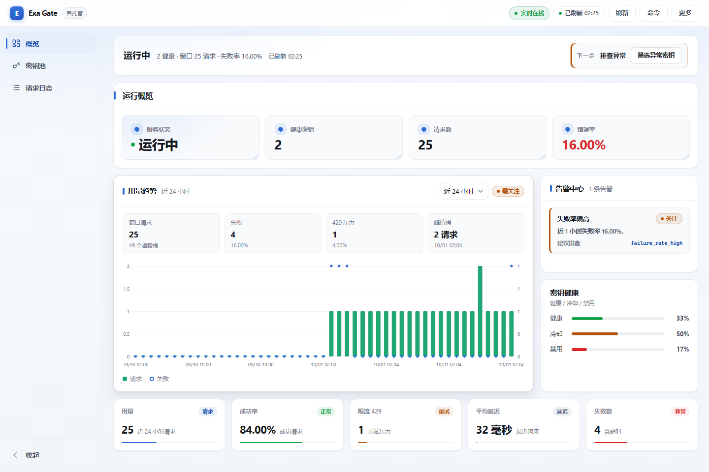
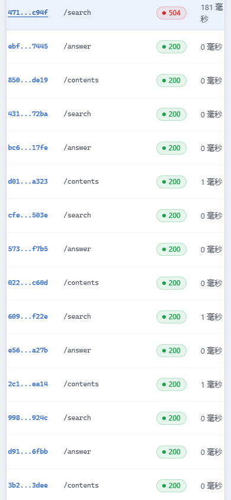

# Exa Gate

> **Exa API 密钥池网关** —— 把多把 Exa API Key 变成一个稳定、可观测、可备份的 API 出口。单二进制 Go 网关，内置密钥池调度、故障转移、加密存储和 Web 运维台。

[](https://github.com/apaidedie/exa-gate/actions/workflows/go-ci.yml)
[](https://github.com/apaidedie/exa-gate/actions/workflows/codeql.yml)
[](https://github.com/apaidedie/exa-gate/pkgs/container/exa-gate)
[](https://github.com/apaidedie/exa-gate/releases)
[](LICENSE)

把多把 Exa Key 变成一个稳定、可观测、可审计的团队 API 出口。Exa Gate 是一个可自托管的 Exa API 控制平面：业务侧只持有一个客户端令牌，Key 池调度、冷却与故障转移、AES-256-GCM 加密存储、请求日志、告警和运维控制台都在代理层完成。



## 它解决什么问题

| 如果你的现状是 | Exa Gate 给你的答案 |
| --- | --- |
| 多把 Exa Key 散落在脚本里，坏了不知道哪把坏 | 密钥池统一调度（轮询 / 加权 / LRU / 自适应），429、5xx、超时自动换 Key 重试，冷却原因可查。 |
| 想给团队或 Agent 一个稳定出口 | 下游只暴露客户端令牌，转发前剥离外部凭证、注入被调度的上游 Key，支持速率限制与路径白名单。 |
| Key 太多，分不清哪把还有效 | 控制台直接显示真实 Key 便于定位，一键测试 / 禁用 / 清理失效密钥，支持备份导出与批量导入。 |
| 出问题需要证据 | 请求日志、按 requestId 的链路追踪、Prometheus 指标、告警 Webhook、管理操作审计记录。 |

**适合**：自托管在 VPS / 内网、需要多 Key 共享与统一出口的团队、Agent 或搜索服务。
**不适合**：只用一把 Key 的临时调用，或不打算维护自托管服务的场景。

## 快速开始

### Docker 部署（推荐）

```bash
mkdir exa-gate && cd exa-gate
curl -fsSL https://raw.githubusercontent.com/apaidedie/exa-gate/main/docker-compose.yml -o docker-compose.yml
# 编辑三个密钥：EXA_KEYS_ENCRYPTION_SECRET / EXA_PROXY_TOKENS / EXA_ADMIN_TOKENS
docker compose up -d
```

- 镜像：`ghcr.io/apaidedie/exa-gate:latest`（也提供 `2.0.0` 等版本标签）
- 数据：`./data` 挂载为 `/data`，SQLite 持久化，Key 密文落盘
- 控制台：`http://<host>:8787`，登录令牌来自 `EXA_ADMIN_TOKENS`
- 生产建议置于 HTTPS 反代之后并设置 `EXA_ADMIN_REQUIRE_HTTPS=true`（Caddy / nginx 示例见 [docs/DEPLOYMENT.md](docs/DEPLOYMENT.md)）

### 源码运行（单二进制，需 Go 1.26+）

```bash
git clone https://github.com/apaidedie/exa-gate.git
cd exa-gate
CGO_ENABLED=0 go build -o exa-gate ./cmd/exa-gate
EXA_KEYS_ENCRYPTION_SECRET=$(openssl rand -hex 32) EXA_PROXY_TOKENS=local-client-token-16 EXA_ADMIN_TOKENS=local-admin-token-16 ./exa-gate
```

打开 `http://127.0.0.1:8787`。管理员令牌仅用于控制台，不是 Exa API Key。

### 首次接入

```bash
# 添加第一把 Exa Key（也可在控制台批量导入）
curl -X POST http://127.0.0.1:8787/_proxy/keys   -H "Authorization: Bearer <管理员令牌>"   -H "Content-Type: application/json"   -d '{"id":"exa_01","value":"<Exa API Key>","weight":1}'

# 业务侧这样调用（与 Exa 官方 API 同形）
curl -X POST http://127.0.0.1:8787/search   -H "Authorization: Bearer <客户端令牌>"   -H "Content-Type: application/json"   -d '{"query":"latest AI search news","numResults":3}'
```

## 控制台

纯静态 HTML/CSS/ES Modules（`go:embed` 打入二进制），无框架、无 CDN 依赖；顶栏版本芯片自动对比 GitHub 最新 Release 提示升级。


**概览** —— 运行态势、健康密钥 / 请求数 / 错误率 KPI、24 小时用量趋势、告警中心与密钥健康分布。异常时"下一步"卡片直接给出可点击的处理动作。

**密钥池** —— 表格 / 卡片双视图，直接显示真实 Key 便于在几百把中定位；批量导入（支持 `id:key:weight` 与文件预检）、批量启用 / 禁用 / 测试 / 删除、全选匹配项、一键清理失效密钥、备份导出；选中密钥后侧栏提供测试、日志定位、复制、启停、删除与 24 小时用量。

**请求日志** —— 关键词 / 路径 / 密钥 / 状态多条件筛选，点击 requestId 展开尝试顺序与密钥链路，CSV 导出与过期清理。



## 核心能力

| 能力 | 说明 |
| --- | --- |
| 调度策略 | `round_robin` / `weighted_round_robin` / `least_recently_used` / `adaptive_weighted`，按失败信号动态降权。 |
| 故障转移 | 429 退避冷却、5xx / 超时 / 连接错误换 Key 重试，402 判定额度耗尽自动禁用。 |
| 资源亲和 | 同一资源（websets / research / agent 运行等）的后续请求优先回到创建它的 Key。 |
| 响应缓存 | `/search` 幂等响应内存 LRU 缓存（TTL 可配），命中不加压。 |
| 密钥治理 | 控制台 / API 增删改查、批量导入导出、单 Key 健康检查、冷却重置；SQLite 加密存储，密钥轮换迁移内置。 |
| 可观测 | 请求日志 + 链路追踪 + Prometheus 指标 + Grafana 面板 + SSE 实时刷新 + 告警 Webhook。 |
| 性能 | Go net/http 连接池（H2 可选）、代理自身开销 p50 ≈ 0.1ms；空闲常驻内存 ~39MB。 |
| 工程 | Go 类型检查、`go test` 单测（含 Node↔Go 加密互操作夹具）、CodeQL、OpenAPI 3.1 契约。 |

## 内存占用

控制台按百分比看容器内存时，注意分母是宿主机总内存。Go 运行时空闲常驻通常在 30-40MB 量级，远低于 Node/Python 等动态语言运行时。看绝对值更准确：

```bash
docker stats --no-stream
```

若要硬性上限，在 compose 里加：

```yaml
services:
  exa-gate:
    mem_limit: 128m        # 超限会被 OOM kill，按需调整
```

判断是否泄漏的方法：连续几天观察 `docker stats`，若 RSS 单调上涨逼近上限（而非稳定在某个水位），抓 pprof 排查。

## 配置

完整清单见 [.env.example](.env.example)。常用项：

| 变量 | 默认值 | 说明 |
| --- | --- | --- |
| `EXA_KEYS_ENCRYPTION_SECRET` | 必填 | SQLite 中 Key 的加密密钥（`openssl rand -hex 32`），配合 `EXA_KEYS_ENCRYPTION_SECRET_LEGACY` 支持轮换 |
| `EXA_PROXY_TOKENS` | 必填 | 客户端令牌（≥16 字符，逗号分隔多个） |
| `EXA_ADMIN_TOKENS` | 空 | 管理员令牌；留空则管理面整体拒绝（纯代理部署） |
| `EXA_ADMIN_ALLOW_RAW_KEY_DISPLAY` | `true` | 自托管默认在密钥池明文显示 Key；多人共用设为 `false` 收紧明文展示与备份导出 |
| `EXA_SELECTION_STRATEGY` | `weighted_round_robin` | 调度策略，见上表 |
| `EXA_SEARCH_CACHE_TTL` | `0` | `/search` 响应缓存秒数，0 关闭 |
| `EXA_RESOURCE_AFFINITY` | `true` | 资源亲和调度 |
| `EXA_UPSTREAM_ALLOW_H2` | `true` | 上游 HTTP/2 连接池 |
| `EXA_MAX_ATTEMPTS` | `3` | 单请求最大尝试数 |
| `EXA_ALLOWED_PATHS` | `/**` | 允许代理的路径 |
| `EXA_LOG_RETENTION_DAYS` | `14` | 请求日志保留天数 |
| `EXA_PROXY_RATE_LIMIT_PER_MINUTE` | `0` | 每 client token 每分钟请求数上限（滑动窗口），0 关闭 |
| `EXA_ALERT_WEBHOOK_URL` | 空 | 告警 Webhook 目标 |
| `EXA_VERSION_CHECK` | `true` | 控制台版本芯片定期对比 GitHub 最新 Release |
| `EXA_ADMIN_REQUIRE_HTTPS` | `false` | 管理面强制 HTTPS 转发头 |

## 管理接口

全部需要管理员认证；机器可读契约见 [docs/openapi.json](docs/openapi.json)，运行时也可访问 `/_proxy/openapi.json`。

### Key 管理

| 方法 | 路径 | 说明 |
| --- | --- | --- |
| `GET` | `/_proxy/keys` | Key 状态与调度器快照 |
| `POST` | `/_proxy/keys` | 创建 Key（`id`, `value`, `weight`） |
| `PUT` | `/_proxy/keys/:id` | 更新 `value` / `weight` / `enabled` |
| `DELETE` | `/_proxy/keys/:id` | 删除 Key（至少保留一把） |
| `POST` | `/_proxy/keys/:id/test` | 单 Key 健康检查 |
| `POST` | `/_proxy/keys/:id/disable` · `enable` · `reset-circuit` | 禁用 / 启用 / 清除冷却 |
| `POST` | `/_proxy/keys/:id/secret` | 查看明文（`EXA_ADMIN_ALLOW_RAW_KEY_DISPLAY=false` 时 403） |
| `POST` | `/_proxy/keys/batch` | 批量 enable / disable / reset / test / delete |
| `POST` | `/_proxy/keys/import` | 批量导入 |
| `GET` | `/_proxy/keys/export` | 全量明文备份 `id:key:weight`（审计记录） |
| `GET` | `/_proxy/keys/:id/failures` | 单 Key 故障摘要 |

### 日志 / 观测 / 会话

| 方法 | 路径 | 说明 |
| --- | --- | --- |
| `GET` | `/_proxy/logs` · `/_proxy/logs/trace/:requestId` · `/_proxy/logs/export` · `POST /_proxy/logs/prune` | 请求日志与链路 |
| `GET` | `/_proxy/observability` · `/_proxy/metrics` · `/_proxy/events` | 趋势告警 / Prometheus / SSE |
| `GET` | `/_proxy/live` · `/_proxy/ready` · `/_proxy/health` | 存活 / 可服务 / 管理健康 |
| `POST` | `/_proxy/session` · `DELETE /_proxy/session` · `GET /_proxy/sessions` | 管理会话生命周期 |
| `GET` | `/_proxy/audit` · `/_proxy/audit/export` | 管理操作审计记录与 CSV |
| `POST` | `/_proxy/alerts/webhook/test` | 测试告警 Webhook |
| `GET` | `/_proxy/config-summary` | 脱敏运行配置 |

## 安全模型

- 下游只持 `EXA_PROXY_TOKENS`；转发前剥离 `Authorization`、`x-api-key` 等外部凭证，再注入被调度的上游 Key。
- SQLite 中的 Key 用 AES-256-GCM 加密（scrypt 派生、按密钥缓存，轮换走 `EXA_KEYS_ENCRYPTION_SECRET_LEGACY` 迁移）。
- 明文展示与备份导出默认开放（自托管单管理员），可用 `EXA_ADMIN_ALLOW_RAW_KEY_DISPLAY=false` 一并关闭；查看明文接口独立审计。
- 管理会话有 TTL、失败登录锁定与可选 HTTPS 强制；静态资源走严格 CSP。
- 请求日志只记录内部 Key ID、状态、路径、延迟与错误类型，不落明文上游 Key。

## 运维

备份 Docker volume 中的 SQLite 状态：

```bash
docker run --rm -v exa-gate-data:/data -v $(pwd):/backup alpine tar czf /backup/exa-gate-data.tar.gz /data
```

恢复：

```bash
docker run --rm -v exa-gate-data:/data -v $(pwd):/backup alpine tar xzf /backup/exa-gate-data.tar.gz -C /
```

监控接入与反代示例见 [docs/DEPLOYMENT.md](docs/DEPLOYMENT.md)，上线前核对清单见 [docs/DEPLOYMENT_CHECKLIST.md](docs/DEPLOYMENT_CHECKLIST.md)。

## 开发

```bash
go vet ./...                        # 静态检查
go test ./... -timeout 180s         # 单元 / 集成测试（含 Node↔Go 加密互操作夹具）
CGO_ENABLED=0 go build -o exa-gate ./cmd/exa-gate   # 本地构建单二进制
```

需要 Go ≥ 1.26；镜像多阶段构建产出 alpine 运行时 + 单二进制（约 25MB），无 Node/npm 依赖。控制台为纯静态文件，经 `go:embed` 打入二进制。

## 许可

[MIT](LICENSE)
