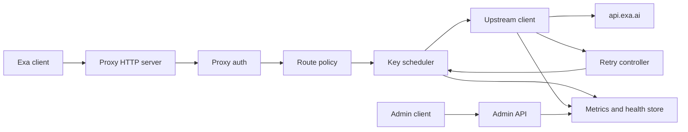

# Exa Reverse Proxy Design

Date: 2026-06-08

## 1. Purpose

Build a reverse proxy service for Exa that exposes a single Exa-compatible API endpoint while managing multiple upstream Exa API keys behind it.

The proxy should let existing Exa clients switch from `https://api.exa.ai` to the proxy base URL with minimal or no request changes. It hides real Exa keys, spreads traffic across the configured key pool, fails over when a key is rate-limited or unhealthy, and records per-key usage and health state.

## 2. Goals

* Preserve Exa official API paths, HTTP methods, query strings, request bodies, response bodies, status codes, and streaming behavior as much as possible.
* Support multiple key selection strategies: round-robin, weighted round-robin, and least-recently-used healthy key.
* Automatically switch keys on rate limits, quota-like errors, timeouts, connection errors, and configured transient upstream status codes.
* Retry failed requests safely with bounded attempts and backoff.
* Circuit-break unhealthy keys and cool them down before reuse.
* Track per-key request count, success count, failure count, error rate, last error, cooldown state, latency, and inferred remaining availability.
* Keep upstream Exa keys private. Downstream clients authenticate to the proxy with separate proxy tokens.
* Provide admin and observability endpoints without leaking raw Exa keys.

## 3. Non-Goals

* Do not modify Exa request or response schemas.
* Do not cache Exa search/content responses in the first version.
* Do not create or manage Exa API keys through Exa Team Management by default.
* Do not bypass Exa account, billing, or acceptable-use controls.
* Do not aggregate multiple partial upstream responses into one synthetic Exa response.

## 4. Upstream Compatibility Scope

The default upstream target is `https://api.exa.ai`.

The public Exa OpenAPI spec currently includes paths such as:

* `/search`
* `/contents`
* `/answer`
* `/monitors` and `/monitors/...`
* `/agent/runs` and `/agent/runs/...`
* `/research/v1` and `/research/v1/...`
* `/v0/teams/me`
* `/v0/websets` and related `/v0/...` Websets, events, webhooks, imports, monitor, and search paths

The proxy should not hard-code request schemas for these endpoints. It should route any request path that is allowed by configuration to the matching upstream path. This preserves compatibility when Exa adds fields or updates endpoint schemas.

Exa Team Management uses a separate upstream host, `https://admin-api.exa.ai/team-management`. It should be disabled by default because it can create, list, update, and delete keys. If needed later, expose it through a separate explicit upstream profile and stricter proxy admin authorization.

## 5. Recommended Approach

Use a single-service gateway with persistent local state.

Alternative approaches considered:

* Lightweight stateless proxy: easiest to build, but cooldowns and key health reset on restart and multi-process behavior is weak.
* Stateful single-service proxy: still simple to run, supports durable stats and cooldowns, and fits local or small-server deployment well.
* Distributed gateway with Redis: best for many replicas, but adds infrastructure and operational complexity before it is needed.

The recommended first implementation is the stateful single-service proxy. It can later swap the state store from SQLite/local file to Redis without changing the external API.

## 6. Architecture

The service has these internal modules:

* HTTP server: receives downstream requests, authenticates proxy clients, and streams or forwards responses.
* Route policy: checks whether the requested path and method are allowed and chooses the upstream profile.
* Key registry: loads configured Exa keys, labels, weights, and optional per-key limits.
* Key scheduler: chooses a healthy key according to the configured strategy.
* Upstream client: forwards the request to Exa with the selected key and preserves request/response semantics.
* Retry controller: decides whether a failed attempt may be retried with another key.
* Circuit breaker: marks keys unhealthy after repeated failures or rate-limit signals and releases them after cooldown.
* Metrics store: records per-request and per-key counters, latency, status classes, cooldowns, and last errors.
* Admin API: exposes sanitized health, stats, and key state controls.



## 7. Request Flow

1. A client sends a request to the proxy using an Exa-compatible path, such as `POST /search`.
2. The proxy validates a downstream proxy credential, such as `Authorization: Bearer <proxy-token>` or `x-proxy-api-key`.
3. The route policy confirms the method and path are allowed.
4. The scheduler chooses a currently healthy Exa key.
5. The proxy forwards the original method, path, query string, body, and most headers to Exa.
6. The proxy removes downstream auth headers and injects the selected upstream Exa credential as `x-api-key: <exa-key>` by default. Bearer upstream auth can be supported by config if needed.
7. The upstream response is streamed back to the client. JSON, binary bodies, and `text/event-stream` should pass through without schema transformation.
8. Metrics and health state are updated after each attempt.
9. If an attempt fails with a retryable condition and retry budget remains, the retry controller asks the scheduler for a different healthy key and tries again.

## 8. Header Handling

Forward by default:

* `Content-Type`
* `Accept`
* `Accept-Encoding`, if the HTTP client can safely stream/decompress it
* `User-Agent`, optionally with a proxy suffix
* Idempotency or tracing headers if present

Strip or replace:

* Downstream `Authorization`
* Downstream `x-api-key`
* Any configured secret-bearing headers
* Hop-by-hop headers such as `Connection`, `Transfer-Encoding`, `Keep-Alive`, `Proxy-Authenticate`, `Proxy-Authorization`, `TE`, `Trailer`, and `Upgrade`

Add:

* Upstream `x-api-key` for the selected Exa key
* `x-request-id` if absent
* Optional `x-proxy-attempt`, only in debug mode and never by default

Response headers should be passed through except hop-by-hop headers and any upstream header that could reveal the selected key.

## 9. Key Configuration

Keys are configured outside source control, preferably by environment variables or a secrets file mounted at runtime.

Example conceptual config:

```yaml
upstreams:
  exa_public:
    base_url: https://api.exa.ai
    auth_header: x-api-key
    allowed_paths:
      - /**

keys:
  - id: exa_a
    value_env: EXA_KEY_A
    weight: 1
    enabled: true
  - id: exa_b
    value_env: EXA_KEY_B
    weight: 2
    enabled: true

routing:
  strategy: weighted_round_robin
  max_attempts: 3
  per_attempt_timeout_ms: 30000
  retry_backoff_ms: [200, 600, 1500]

circuit_breaker:
  failure_threshold: 3
  window_seconds: 60
  cooldown_seconds: 120
  rate_limit_cooldown_seconds: 300

proxy_auth:
  tokens_env: EXA_PROXY_TOKENS
```

The key `id` is safe to log. The actual key value is never logged, returned, or written to metrics.

## 10. Key Selection

The scheduler receives the route, request metadata, and a list of eligible keys.

Eligibility requires:

* `enabled = true`
* not currently in cooldown
* not manually disabled
* not exceeding optional local per-key concurrency or request-rate limits

Strategies:

* Round-robin: each healthy key receives the next request in sequence.
* Weighted round-robin: each key appears according to its configured weight.
* Least-recently-used healthy key: useful when the goal is spreading idle time evenly.

Default strategy: weighted round-robin with every key weight set to 1 unless configured otherwise.

## 11. Retry and Failover

Retryable conditions:

* HTTP `408`
* HTTP `409`, only when configured as transient
* HTTP `425`
* HTTP `429`
* HTTP `500`, `502`, `503`, `504`
* connect timeout, read timeout, connection reset, DNS failure, or TLS handshake failure

Non-retryable by default:

* HTTP `400`, `401`, `403`, `404`, `422`
* client disconnect
* request body too large
* route not allowed

For `429`, the selected key is immediately placed into rate-limit cooldown. If Exa returns `Retry-After` or reset-like rate-limit headers, use that duration with a configured maximum cap. If not, use `rate_limit_cooldown_seconds`.

For timeouts and `5xx`, increment the failure counter. Once the failure threshold is reached within the configured window, open the circuit and cool the key down.

Each retry should use a different key if possible. If no other healthy key exists, the proxy may either retry the same key after backoff or return the last upstream error, depending on config. The recommended default is to return the last upstream error after all eligible keys are exhausted.

## 12. Idempotency and Streaming Rules

Search-style requests are usually safe to retry from the proxy perspective because the response is not a durable mutation owned by the proxy. However, Exa also exposes monitors, agent runs, research tasks, webhooks, imports, and other endpoints that may create durable upstream resources.

Default retry policy by method:

* `GET`, `HEAD`, and `OPTIONS`: retryable when the failure condition is retryable.
* `POST /search`, `POST /contents`, and `POST /answer`: retryable before response streaming starts.
* Other `POST`, `PATCH`, `PUT`, and `DELETE`: retry only when explicitly allowed by route policy or when an idempotency key is present and the endpoint is known to support safe replay.

Streaming responses require special handling:

* If upstream fails before response headers are sent to the downstream client, failover may occur.
* Once response headers or stream chunks have been sent to the client, the proxy must not switch keys and splice another upstream response into the same downstream response.
* Streaming attempts should still update key health and metrics after completion or failure.

## 13. Resource Affinity

Some Exa endpoints create resources that are later read, updated, canceled, or listed by ID, such as agent runs, research tasks, monitors, websets, webhooks, imports, and searches.

If keys belong to different Exa accounts or teams, a resource created with one key may not be visible to another key. To preserve correctness, the proxy should maintain resource affinity mappings:

* When a response creates a resource and includes an ID, store `resource_type`, `resource_id`, and `key_id`.
* For follow-up paths containing that resource ID, prefer the original key.
* If the original key is in cooldown, return the upstream error from that key or a clear proxy `503` instead of silently using another key that may not own the resource.

If all keys are guaranteed to belong to the same Exa team and share resource visibility, resource affinity can be disabled by config. The safe default is enabled.

## 14. Metrics and State

Track at minimum per key:

* total requests
* successful requests
* failed requests
* retry attempts
* HTTP status code counts
* rate-limit count
* timeout count
* rolling error rate
* average and percentile latency, if practical
* last success time
* last failure time
* last error status and short reason
* current state: healthy, cooling_down, open_circuit, disabled
* cooldown expiration time
* inferred remaining availability, when upstream headers or admin data allow it

Track per proxy request:

* request ID
* downstream token ID or client label
* method and path
* selected key IDs, never raw key values
* attempt count
* final status
* total latency
* retry reasons

State store options:

* SQLite for the recommended single-service implementation.
* In-memory for tests and very small local deployments.
* Redis later for multi-replica deployments.

## 15. Admin API

Admin endpoints should be separate from Exa-compatible proxy paths, for example under `/_proxy/*`.

Suggested endpoints:

* `GET /_proxy/health`: service health and upstream summary.
* `GET /_proxy/keys`: sanitized key IDs, enabled state, weights, counters, and cooldowns.
* `POST /_proxy/keys/{id}/disable`: manually disable a key.
* `POST /_proxy/keys/{id}/enable`: re-enable a key.
* `POST /_proxy/keys/{id}/reset-circuit`: clear cooldown and failure window.
* `GET /_proxy/metrics`: Prometheus-style metrics or JSON metrics.

Admin responses must never include raw Exa key values.

## 16. Security

Security requirements:

* Require downstream authentication for all Exa-compatible proxy routes.
* Store Exa keys only in environment variables or an external secrets file outside source control.
* Redact secrets from logs, errors, metrics, and admin responses.
* Use constant-time comparison for proxy tokens.
* Support separate normal-client and admin-client tokens.
* Disable Team Management upstream proxying by default.
* Allow an optional path allowlist so deployments can restrict risky write endpoints.
* Set request body size limits.
* Set upstream timeout limits.
* Avoid logging full request bodies by default because search queries or URLs may be sensitive.

## 17. Error Handling

When an upstream response is returned, preserve the Exa status code and body.

When the proxy itself fails before contacting Exa, return proxy-owned errors:

* `401` for missing or invalid proxy auth.
* `403` for authenticated clients without permission for the route.
* `404` for disallowed proxy paths if hiding route policy is preferred, otherwise `403`.
* `413` for body too large.
* `429` for local proxy client rate limits.
* `502` when Exa returns an invalid response or all attempts fail due to upstream protocol errors.
* `503` when no healthy key is available.
* `504` when all attempts time out.

Proxy-owned errors should use a stable JSON shape:

```json
{
  "error": {
    "type": "proxy_error",
    "code": "no_healthy_keys",
    "message": "No healthy Exa API key is currently available.",
    "requestId": "req_..."
  }
}
```

## 18. Observability

Logs should be structured JSON with these fields:

* timestamp
* level
* request_id
* client_id
* method
* path
* key_id
* attempt
* status
* latency_ms
* retry_reason
* error_code

Metrics should include:

* `exa_proxy_requests_total`
* `exa_proxy_attempts_total`
* `exa_proxy_upstream_latency_ms`
* `exa_proxy_key_state`
* `exa_proxy_key_cooldowns_total`
* `exa_proxy_retries_total`
* `exa_proxy_no_healthy_keys_total`

## 19. Configuration Defaults

Recommended defaults:

* listen address: `0.0.0.0:8787`
* upstream base URL: `https://api.exa.ai`
* strategy: `weighted_round_robin`
* per-attempt timeout: `30s`
* total attempts: `min(3, number_of_eligible_keys)`
* retry backoff: `200ms`, `600ms`, `1500ms` with jitter
* normal failure cooldown: `120s`
* rate-limit cooldown: `300s`, overridden by `Retry-After` when present
* circuit breaker window: `60s`
* circuit breaker threshold: `3` failures in the window
* max request body: `20MB`
* metrics store: SQLite file under the application data directory

## 20. Testing Plan

Unit tests:

* key scheduler fairness for round-robin and weighted round-robin
* cooldown and circuit breaker state transitions
* retry classification by status code and exception type
* header stripping and upstream auth injection
* path allowlist behavior
* secret redaction
* resource affinity lookup

Integration tests with a fake Exa upstream:

* successful transparent pass-through
* `429` on first key then success on second key
* timeout on first key then success on second key
* all keys cooling down returns `503`
* streaming response passes through unchanged
* streaming failure after first chunk does not retry into the same response
* non-idempotent write endpoint does not retry unless configured
* admin endpoints expose sanitized key state only

Manual tests with real Exa keys:

* `POST /search`
* `POST /contents`
* `POST /answer`
* one streaming `/search` request with `stream: true`
* SDK base URL replacement, if the selected Exa SDK supports custom base URLs

## 21. Rollout Plan

1. Implement the transparent proxy core with a fake upstream test suite.
2. Add key scheduling, metrics, and cooldowns.
3. Add bounded retries and failover.
4. Add admin endpoints and secret redaction.
5. Add resource affinity for durable resource endpoints.
6. Validate with real Exa search, contents, answer, and streaming calls.
7. Run in local-only mode first, then expose behind HTTPS or an existing reverse proxy.

## 22. Open Decisions

* Runtime language and framework: Node.js/Fastify, Python/FastAPI, or Go are all suitable. Go gives strong streaming and single-binary deployment. Node.js is ergonomic for proxying and JSON config. Python is easiest if the surrounding tooling is Python-heavy. Recommended default for this project: Node.js with Fastify and Undici, unless the implementation phase discovers a stronger local preference.
* State backend: SQLite is recommended for the first version. Redis should be chosen if multiple proxy replicas must share key health in real time.
* Resource affinity extraction: start with known Exa resource response shapes and add a conservative fallback that does not guess unknown IDs.
* Admin exposure: keep admin routes bound to localhost by default unless explicitly configured.

## 23. Acceptance Criteria

The design is complete when an implementation can satisfy these behaviors:

* A client can call the proxy using official Exa paths and request formats.
* The proxy injects upstream Exa keys without exposing them to clients.
* Healthy keys are selected by round-robin or weight.
* `429`, timeout, and `5xx` failures move traffic to another eligible key when safe.
* Unhealthy keys enter cooldown and recover automatically.
* Per-key counters, error rates, cooldown state, and last errors are visible through sanitized admin endpoints.
* Streamed Exa responses are not buffered or corrupted.
* Durable resource follow-up requests use the same key that created the resource unless affinity is disabled.
* No raw Exa key appears in logs, metrics, admin responses, or client errors.
